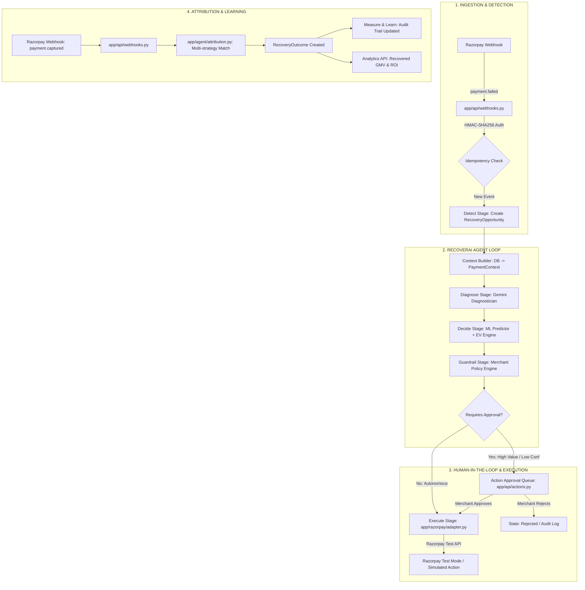
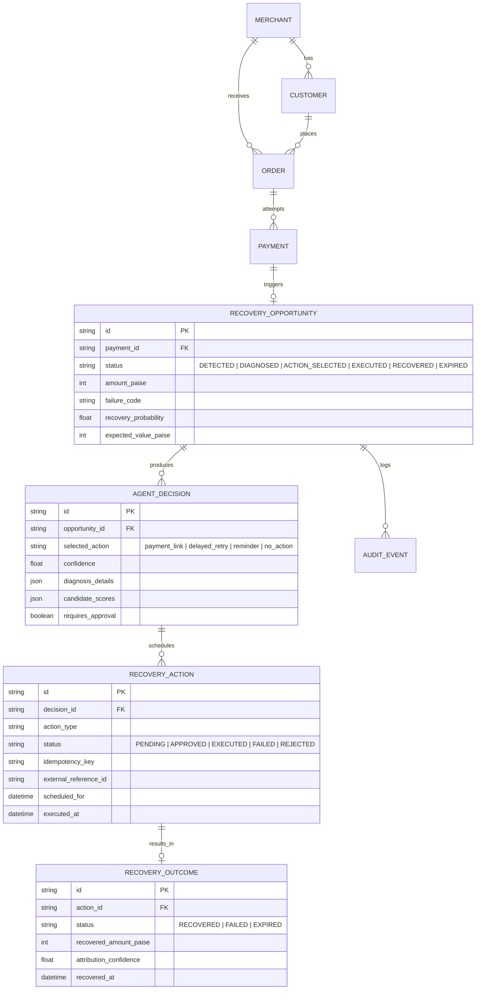

# RecoverAI — Complete Architectural Flow & Technical Master Report

> **Target Audience**: AI Agents, Systems Architects, and Engineers  
> **Repository**: `RecoverAI`  
> **Status**: Phases 0–6 Complete | Test Suite: **89 Passed, 0 Failed**  
> **Last Verified**: September 2026

---

## 1. Executive Summary & Core Mission

**RecoverAI** is an autonomous, context-aware revenue recovery agent purpose-built for **Razorpay** merchants.

### The Problem
Traditional payment recovery in e-commerce relies on brute-force, blind retries or generic payment links. This leads to:
- High merchant fees on futile retries
- Customer annoyance and churn due to excessive notifications
- Inability to distinguish between transient technical glitches, insufficient funds, and deliberate abandonment

### The Solution
RecoverAI sits between Razorpay payment failure webhooks and merchant intervention channels. It replaces static rules with an **8-stage agent loop** that:
1. Captures failed payment webhooks in real time with constant-time HMAC-SHA256 verification.
2. Synthesizes merchant, customer, order, and historical payment signals into a rich `PaymentContext`.
3. Calls **Google Gemini** (with deterministic fallbacks) for structured failure diagnosis and behavioral hypotheses.
4. Uses specialized **Machine Learning predictors** to estimate recovery probabilities for multiple intervention strategies.
5. Calculates **Expected Value (EV)** ($EV = P(\text{recovery}) \times \text{Amount} - \text{Intervention Cost}$) to select the mathematically optimal action.
6. Enforces **strict deterministic merchant guardrails** (confidence floors, opt-outs, frequency caps, manual approval thresholds).
7. Executes actions safely via the **Razorpay Action Adapter** in Test Mode with idempotency guarantees.
8. Attributes subsequent customer payments back to the intervention, updating analytics and auditing the decision trail.

---

## 2. High-Level Architecture Diagram



---

## 3. The 8-Stage Agent State Machine

The core intelligence lifecycle is implemented in [`app/agent/orchestrator.py`](../app/agent/orchestrator.py) across 8 distinct stages:

```
DETECT ──> DIAGNOSE ──> DECIDE ──> GUARDRAIL ──> EXECUTE ──> MEASURE ──> LEARN ──> REPLAN
```

| Stage | Class / Function | Primary Responsibilities | Real vs Fallback / Guard |
|---|---|---|---|
| **1. Detect** | `orchestrator.detect()` | Parses failure payload, persists `Payment`, creates `RecoveryOpportunity` in `DETECTED` status. | Rejects duplicate webhook payloads via event ID. |
| **2. Context** | `ContextBuilder.build()` | Aggregates Merchant policies, Customer history (past attempts, recovery count, opt-out status), Order items, and Payment error metadata into `PaymentContext`. | Fully deterministic SQL queries with fallback defaults if records are missing. |
| **3. Diagnose** | `GeminiDiagnostician.diagnose()` | Evaluates payment context using Google Gemini with structured JSON schema (`failure_category`, `root_cause_hypothesis`, `customer_sentiment`, `recommended_strategy`, `confidence`). | Automatic fallback to deterministic heuristics if Gemini API key is missing or call fails. |
| **4. Decide** | `RecoveryDecisionEngine.evaluate()` | Generates candidates (`payment_link`, `delayed_retry`, `reminder`, `no_action`). Uses `RecoveryPredictor` to infer $P(\text{recovery})$ and calculates Net EV ($P \times \text{amount} - \text{cost}$). | Ranks candidates strictly by Net Expected Value. `no_action` always has EV = 0. |
| **5. Guardrail** | `apply_guardrails_to_candidates()` | Evaluates 6 non-negotiable merchant policies: Opt-out, max attempts exceeded, contact cooldown, confidence floor, minimum EV threshold, and high-value approval checks. | Purely deterministic. Strips ineligible candidates. Flags `requires_approval=True` if threshold breached. |
| **6. Execute** | `RazorpayActionAdapter.execute_action()` | Dispatches action. For `payment_link`, calls Razorpay Test Mode API (or falls back to mock if no keys). For `delayed_retry` and `reminder`, simulates dispatch. Records idempotency key. | **Test Mode Safety**: Explicitly rejects live API keys (`rzp_live_*`). Gated by human approval if flagged. |
| **7. Measure** | `attribute_webhook_event()` | Correlates incoming `payment.captured` or `order.paid` webhooks against active recovery actions using exact payment ID, order ID, or customer window matching. | Creates `RecoveryOutcome` with attribution confidence score (1.0 for direct, 0.85 for order match, 0.7 for window). |
| **8. Learn / Replan** | `orchestrator.learn()`, `replan()` | Logs structured `AuditEvent` records for outcomes. If an executed action fails or times out, triggers `replan()` to pick the next-best eligible candidate. | Real audit logging. Does not mutate ML weights in-flight (avoids catastrophic drift). |

---

## 4. Separation of Concerns: LLM vs. ML vs. Deterministic

RecoverAI follows a strict **Safety-First AI Architecture**:

```
+-----------------------------------------------------------------------------+
| DETERMINISTIC LAYER (Non-Negotiable Business Logic & Guardrails)            |
| - Guardrail checks (opt-out, frequency caps, cooldowns)                     |
| - Mathematical EV computation: EV = (P_rec * Amount) - Action_Cost         |
| - Human-in-the-loop approval gating (Amount > Threshold or Conf < Min)      |
| - Idempotency enforcement & Razorpay key safety checks                      |
| - Database transaction persistence & HMAC signature verification           |
+-----------------------------------------------------------------------------+
                                     ^
                                     |
+------------------------------------+----------------------------------------+
| STATISTICAL ML LAYER (Predictive)  | GENERATIVE LLM LAYER (Explanatory)     |
| - Model: LogisticRegression        | - Model: Google Gemini 1.5/2.0 Flash   |
| - Input: 16 engineered features   | - Input: JSON-serialized Context       |
| - Output: Calibrated P(recovery)   | - Output: Failure diagnosis, sentiment,|
|   per strategy                     |   root cause hypothesis, audit text    |
| - Deterministic execution runtime  | - Gated: Structured JSON output only   |
|   (cannot hallucinate numbers)     | - Isolated: Cannot trigger actions     |
+------------------------------------+----------------------------------------+
```

1. **LLM Never Executes Actions**: Gemini is solely an explanatory and contextual diagnostician. It cannot write to the database, trigger APIs, or modify monetary values.
2. **ML Never Overrides Guardrails**: Even if ML predicts a 99% recovery probability, a customer opt-out or cooldown cap instantly invalidates the candidate.
3. **Approval Cannot Be Bypassed**: If an action requires approval, the execution adapter rejects calls until a merchant record exists in the approval audit table with `status = APPROVED`.

---

## 5. Complete Codebase Directory & File Map

```
RecoverAI/
│
├── app/                                # Core Backend Application (FastAPI + SQLAlchemy)
│   ├── main.py                         # FastAPI app entry point, CORS, routers registration
│   │
│   ├── core/                           # System Configuration & Security
│   │   ├── config.py                   # Pydantic Settings (DB URL, Razorpay keys, Gemini key)
│   │   ├── database.py                 # SQLAlchemy engine, sessionmaker, get_db dependency
│   │   └── security.py                 # HMAC-SHA256 signature verification (constant-time)
│   │
│   ├── db/                             # Relational Persistence Layer
│   │   └── models.py                   # SQLAlchemy ORM definitions:
│   │                                   # - Merchant, Customer, Order, Payment
│   │                                   # - RecoveryOpportunity, AgentDecision
│   │                                   # - RecoveryAction, RecoveryOutcome, AuditEvent
│   │
│   ├── domain/                         # Domain Entities & Deterministic Logic
│   │   ├── models.py                   # Dataclasses: PaymentContext, MerchantPolicy,
│   │   │                               # RecoveryCandidate, GuardrailResult, DiagnosisResult
│   │   └── guardrails.py               # Deterministic rule engine:
│   │                                   # - check_opt_out, check_max_attempts
│   │                                   # - check_contact_cooldown, check_confidence_floor
│   │                                   # - apply_guardrails_to_candidates
│   │                                   # - check_approval_requirement
│   │
│   ├── ml/                             # Machine Learning & Probability Estimation
│   │   ├── features.py                 # 16-feature extractor from PaymentContext
│   │   ├── predictor.py                # RecoveryPredictor (LogisticRegression per action)
│   │   └── train.py                    # Training script on synthetic failure dataset
│   │
│   ├── agent/                          # Autonomous Recovery Agent
│   │   ├── state.py                    # AgentState dataclass, AgentStage Enum
│   │   ├── context_builder.py          # Builds PaymentContext from relational DB tables
│   │   ├── diagnosis.py                # GeminiDiagnostician (Google Gemini + fallback)
│   │   ├── decision_engine.py          # RecoveryDecisionEngine (Candidate scoring & EV)
│   │   ├── attribution.py              # Webhook outcome attribution (3 match strategies)
│   │   └── orchestrator.py             # 8-Stage State Machine Orchestrator
│   │
│   ├── razorpay/                       # Razorpay Integration Layer
│   │   └── adapter.py                  # RazorpayActionAdapter:
│   │                                   # - Test Mode key verification (rzp_test_*)
│   │                                   # - payment_link execution (Real API or Mock)
│   │                                   # - delayed_retry & reminder execution (Simulated)
│   │                                   # - Idempotency key registry
│   │
│   └── api/                            # REST API Endpoints
│       ├── webhooks.py                 # Razorpay Webhook receiver (HMAC auth, idempotency)
│       ├── opportunities.py            # Recovery opportunity listing, detail, trigger decide
│       ├── actions.py                  # Recovery actions listing, approval, manual execution
│       └── analytics.py                # Aggregated recovery GMV, rates, and baseline metrics
│
├── frontend/                           # Next.js 14 Merchant Dashboard
│   ├── app/
│   │   ├── layout.tsx                  # App layout, font, theme configuration
│   │   ├── page.tsx                    # Landing page / redirect to overview
│   │   └── (app)/                      # Authenticated Merchant Portal routes
│   │       ├── layout.tsx              # Sidebar navigation and header
│   │       ├── overview/page.tsx       # Live KPI cards, GMV at risk, recovery metrics
│   │       ├── opportunities/page.tsx  # Interactive opportunity table with status filters
│   │       ├── opportunities/[id]/     # Opportunity detail: reasoning, diagnosis, EV scores
│   │       ├── approvals/page.tsx      # High-value action approval/rejection queue
│   │       └── analytics/page.tsx      # Performance charts: RecoverAI vs Baseline
│   │
│   ├── components/                     # Reusable UI Components
│   │   ├── ui/                         # shadcn/ui components (cards, tables, badges, buttons)
│   │   └── sidebar.tsx                 # Clean, fintech-grade merchant navigation bar
│   │
│   └── lib/
│       ├── api.ts                      # Strongly-typed Axios/Fetch client for backend endpoints
│       └── utils.ts                    # Formatting utilities (currency in INR, date strings)
│
├── simulator/                          # Synthetic Data & Baseline Evaluation
│   ├── generator.py                    # 30,000 synthetic transaction generator
│   ├── baseline_eval.py                # Deterministic baseline: naive payment link policy
│   └── recoverai_eval.py               # RecoverAI EV policy evaluation & comparison
│
├── tests/                              # Comprehensive Test Suite (89 Tests)
│   ├── conftest.py                     # Pytest fixtures, test SQLite DB, mock payloads
│   ├── test_webhooks.py                # HMAC validation, duplicate handling, event parsing
│   ├── test_guardrails.py              # Individual & combined guardrail rule tests
│   ├── test_decision_engine.py         # EV calculations, candidate ranking, tie-breaking
│   ├── test_agent_orchestrator.py      # Full 8-stage state machine integration tests
│   ├── test_razorpay_adapter.py        # Test mode enforcement, payment link API, mocks
│   ├── test_attribution.py             # Direct, order, and time-window attribution
│   ├── test_api_opportunities.py       # Opportunities REST endpoints
│   ├── test_api_actions.py             # Action queue, approval gating, execution
│   ├── test_api_analytics.py           # Metrics aggregation & baseline formulas
│   └── test_e2e_flow.py                # Full lifecycle end-to-end integration test
│
├── alembic/                            # Database Migrations
├── requirements.txt                    # Python dependencies (FastAPI, SQLAlchemy, scikit-learn, etc.)
└── .env.example                        # Template for environment configuration
```

---

## 6. Detailed Data & Entity Relationship Model



---

## 7. Razorpay Integration: Real Test Mode vs. Simulated

To guarantee safety during buildathons and demonstrations, RecoverAI strictly regulates calls to external APIs:

| Capability | Real Test Mode API | Simulated Implementation | Safety Safeguard |
|---|---|---|---|
| **Webhook Ingestion** | **YES** | N/A | Raw byte HMAC-SHA256 signature verification (`X-Razorpay-Signature`). Constant-time comparison. |
| **`payment_link`** | **YES** (when keys configured) | Fallback mock (`plink_test_*`) when unconfigured | Uses Razorpay API `POST /v1/payment_links`. Enforces Test Mode key prefix (`rzp_test_`). Rejects `rzp_live_`. |
| **`delayed_retry`** | NO | **YES** (`retry_test_*`) | Managed via internal scheduled execution queue and database state tracking. |
| **`reminder`** | NO | **YES** (`rem_test_*`) | Simulated SMS/WhatsApp customer notifications with cooldown tracking. |
| **Idempotency** | **YES** | **YES** | Key: `rec_act_{action_id}_{hash}`. Duplicate executions return existing record without calling external APIs. |

---

## 8. Expected Value (EV) Decision Engine Mathematics

For each failed payment, RecoverAI evaluates a candidate vector $C = \{\text{payment\_link}, \text{delayed\_retry}, \text{reminder}, \text{no\_action}\}$.

### The Formula
$$\text{Net EV}(a) = \left( P(\text{recovery} \mid a, \mathbf{x}) \times \text{Amount} \right) - \text{Cost}(a)$$

Where:
- $\mathbf{x}$ is the 16-dimensional feature vector (customer history, time of day, failure reason, device, amount).
- $P(\text{recovery} \mid a, \mathbf{x})$ is predicted by strategy-specific calibrated logistic regression models.
- $\text{Cost}(a)$ is the merchant intervention cost (gateway fees, WhatsApp/SMS API costs, customer goodwill friction):
  - $\text{Cost}(\text{payment\_link}) \approx 200 \text{ paise (₹2.00)}$
  - $\text{Cost}(\text{delayed\_retry}) \approx 50 \text{ paise (₹0.50)}$
  - $\text{Cost}(\text{reminder}) \approx 100 \text{ paise (₹1.00)}$
  - $\text{Cost}(\text{no\_action}) = 0 \text{ paise}$

### Guardrail Filtering
Before ranking by EV, candidates are filtered through deterministic policies:
1. If $\text{attempts} \ge \text{max\_attempts} \implies$ drop active channels.
2. If $\text{opted\_out} = \text{True} \implies$ drop `reminder` and `payment_link`.
3. If $P(\text{recovery}) < \text{confidence\_floor} \implies$ drop candidate.
4. If $\text{Net EV} \le 0 \implies$ fall back to `no_action`.

---

## 9. End-to-End Execution Flow (Step-by-Step)

```
[Customer Checkout]
       │
       ▼ (Payment Fails at Razorpay Gateway)
[Razorpay Webhook: payment.failed]
       │
       ▼
1. app/api/webhooks.py
   - Validates HMAC-SHA256 signature using raw request body.
   - Checks event_id against DB to prevent replay attacks.
       │
       ▼
2. app/agent/orchestrator.py::detect()
   - Persists Payment (status=FAILED, error_code="BAD_REQUEST_ERROR").
   - Creates RecoveryOpportunity (status=DETECTED).
       │
       ▼
3. app/agent/context_builder.py::build()
   - Queries customer lifetime transactions, failure history, order metadata.
   - Formulates PaymentContext object.
       │
       ▼
4. app/agent/diagnosis.py::diagnose()
   - Calls Google Gemini 1.5/2.0 Flash with PaymentContext.
   - Returns structured JSON: hypothesis, failure category, customer sentiment.
       │
       ▼
5. app/agent/decision_engine.py::evaluate()
   - Extracts 16 numerical features from context.
   - RecoveryPredictor outputs P(recovery) for each strategy.
   - Calculates Net Expected Value (EV) for all candidates.
       │
       ▼
6. app/domain/guardrails.py::apply_guardrails_to_candidates()
   - Filters out disallowed channels (cooldown, opt-out, max retries).
   - Selects candidate with highest positive Net EV.
   - Evaluates approval policy: if amount > ₹10,000 or confidence < 60%, flags requires_approval=True.
       │
       ▼
7. app/agent/orchestrator.py (Branching)
   ├── IF requires_approval == True:
   │      - Creates RecoveryAction (status=PENDING).
   │      - Surfaced in frontend /approvals page.
   │      - Halts execution until merchant clicks "Approve".
   └── IF requires_approval == False:
          - Creates RecoveryAction (status=APPROVED).
          - Proceeds immediately to step 8.
       │
       ▼
8. app/razorpay/adapter.py::execute_action()
   - Validates API key prefix (rzp_test_*).
   - Checks action idempotency key.
   - Creates real Razorpay Payment Link or simulated retry.
   - Updates RecoveryAction (status=EXECUTED, external_id=plink_xxx).
       │
       ▼ (Customer clicks link and completes payment)
[Razorpay Webhook: payment.captured]
       │
       ▼
9. app/agent/attribution.py::attribute_webhook_event()
   - Matches captured payment to external_id or order_id.
   - Creates RecoveryOutcome (status=RECOVERED, amount=paise).
   - Updates RecoveryOpportunity (status=RECOVERED).
       │
       ▼
10. app/agent/orchestrator.py::learn()
    - Appends outcome to AuditEvent table.
    - Updates frontend analytics KPI cards (Recovered GMV, Success Rate).
```

---

## 10. How to Run, Test, and Demonstrate

### Environment Prerequisites
Ensure `.env` contains:
```env
APP_ENV=development
DATABASE_URL=sqlite:///./recoverai.db
RAZORPAY_KEY_ID=rzp_test_YourTestKeyId
RAZORPAY_KEY_SECRET=YourTestKeySecret
RAZORPAY_WEBHOOK_SECRET=YourWebhookSecret
GOOGLE_API_KEY=YourGeminiApiKey
```

### Running Backend
```bash
# Activate virtual environment
.\.venv\Scripts\Activate.ps1

# Run full test suite (89 passing tests)
pytest -q

# Start FastAPI server
uvicorn app.main:app --host 127.0.0.1 --port 8000 --reload
```
API Documentation: `http://127.0.0.1:8000/docs`

### Running Frontend
```bash
cd frontend
npm install
npm run dev
```
Dashboard URL: `http://localhost:3000`

---

## 11. Known Limitations & Production Recommendations

1. **Delayed Retry & Reminder Execution**: Currently simulated in the adapter (`retry_test_*`, `rem_test_*`). For production, wire `delayed_retry` to Razorpay Card Recurring / Auto-debit APIs or Celery/Temporal scheduled workers, and `reminder` to an official WhatsApp Business / SMS gateway (e.g. Twilio, Gupshup).
2. **Online Learning Loop**: The `Learn` stage currently creates structured audit events. In production, this data should feed an automated periodic model retraining pipeline (e.g. daily batch training) to adapt to shifting merchant fraud/failure patterns.
3. **Analytics API Baseline Benchmark**: The live API currently uses an inline benchmark estimation ($0.35 \times \text{Recovered GMV}$) for real-time responsiveness. The full rigorous offline evaluation is available in `simulator/recoverai_eval.py`.

---

## 12. Summary for Future Agents

When maintaining or extending RecoverAI:
- **Never bypass `app/domain/guardrails.py`**: All actions must be validated through deterministic policies.
- **Never allow the LLM to trigger actions**: Keep Gemini strictly in `app/agent/diagnosis.py` returning explanatory JSON.
- **Always preserve Test Mode enforcement**: `app/razorpay/adapter.py` must never accept live credentials (`rzp_live_*`).
- **Maintain idempotency**: All mutating operations must check the idempotency register before external dispatch.
- **Run the full test suite** after any modifications: `pytest -q` (all 89 tests must pass).
